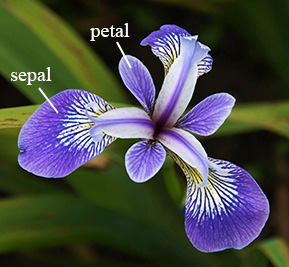

```{r setup, include=FALSE}
knitr::opts_chunk$set(echo = TRUE,warning = FALSE,message = FALSE)
```

## Iris data set

The Iris flower data set or Fisher's Iris data set is a multivariate data set introduced by the British statistician and biologist Ronald Fisher in his 1936 paper The use of multiple measurements in taxonomic problems as an example of linear discriminant analysis.



```{r}
library(dplyr)
library(plotly)

require("datasets")
data("iris") # load Iris Dataset
data.table::data.table(iris %>% head)
```

```{r}
plot_ly(data = iris, x = ~Sepal.Length, y = ~Petal.Length, color = ~Petal.Width, symbol = ~Species, size=~Sepal.Width)
```


```{r}
#view statistical summary of dataset
summary(iris) 
```

```{r}
normalize <- function(x){
  return ((x-min(x))/(max(x)-min(x)))
}
iris<-iris %>% mutate_at(vars(Sepal.Length:Petal.Width), normalize)
data.table::data.table(iris %>% head)
```
```{r}
result<- kmeans(iris %>% select(-c(Species)),3)
```

```{r}
result$betweenss / result$totss

```

```{r}
res_list = list()
for (i in 2:9) {
  res <- kmeans(iris %>% select(-c(Species)),i)
  res_list[[i-1]] <- round(res$betweenss / res$totss,5)
  print(paste(i,"clusters yeilds ratio", res_list[[i-1]]))
}
plot(2:9,res_list %>% unlist, xlab = "clusters", ylab = "ratio", type = "l")
```


```{r}
result$centers
```

```{r}
iris$pred <- result$cluster
result$cluster
```
```{r}
iris %>% select(Species) %>% unique()
```

```{r}
mapping         <- table(result$cluster,iris$Species) %>% apply(.,2,which.max)
mapping_df      <- data.frame(Species=mapping %>% names,label = mapping %>% as.numeric())
mapping_df_rev  <- data.frame(Classpred=mapping %>% names,pred = mapping %>% as.numeric())

#iris
```


```{r}
iris<-iris %>% inner_join(mapping_df,by = "Species") %>%
  inner_join(mapping_df_rev,by = "pred") %>% 
  mutate(term = recode(Species,
                       "setosa" = "circle",
                       "versicolor" = "cross",
                       "virginica" = "diamond")) %>%
  mutate(correctness = if_else(label==pred,"circle","cross")) 
    
#iris
```

### Lidt sjov med 3d

```{r}
plot_ly(iris, x = ~Sepal.Width, y = ~Sepal.Length, z = ~Petal.Length,
        marker = list(color = ~Petal.Width,
                      colorscale='Viridis',#colorscale = c('#FFE1A1', '#683531'),
                      showscale = TRUE,
                      symbol=~term)) %>%
  add_markers() %>%
  layout(scene = list(
    xaxis = list(title = 'Sepal width'),
    yaxis = list(title = 'Sepal length'),
    zaxis = list(title = 'Petal length')),
         annotations = list(
           x = 1.13,
           y = 1.05,
           text = 'Petal width',
           xref = 'paper',
           yref = 'paper',
           showarrow = FALSE
         ))

```


```{r}
p1 <- plot_ly(data = iris, x = ~Sepal.Length, y = ~Petal.Length,
              symbol = ~Classpred, size=~Sepal.Width, showscale=FALSE ) %>% layout(showscale = FALSE)
p2 <- plot_ly(data = iris, x = ~Sepal.Length, y = ~Petal.Length, symbol = ~Species, size=~Sepal.Width, showscale=FALSE ) %>% layout(showscale = FALSE)

subplot(p1, p2) %>% layout(showscale = FALSE,showlegend = FALSE)
```


```{r}
plot_ly(data = iris, x = ~Sepal.Length, y = ~Petal.Length, symbol = ~correctness, size=~Sepal.Width)
```


```{r}
table(result$cluster,iris$Species)
```


